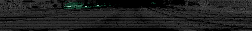
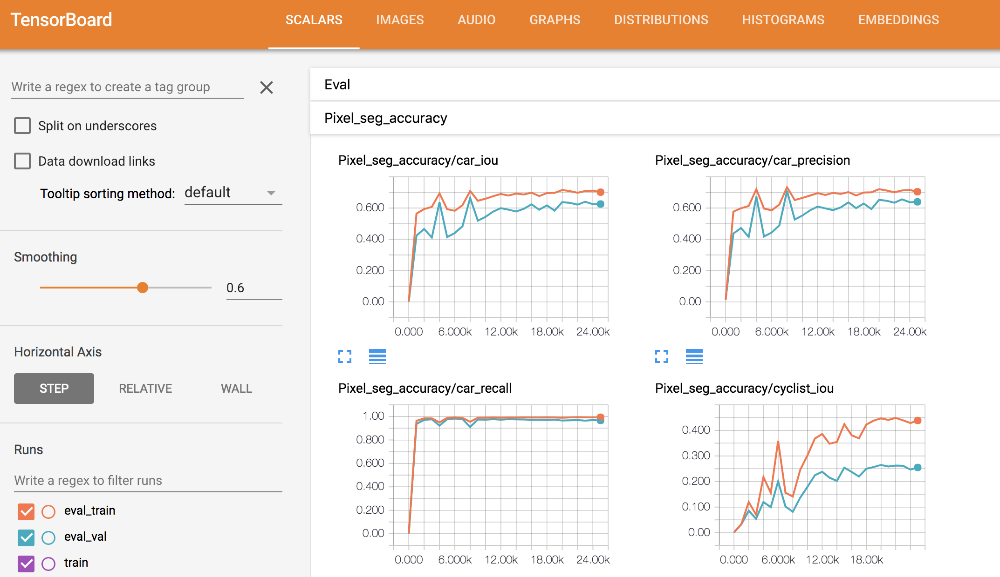
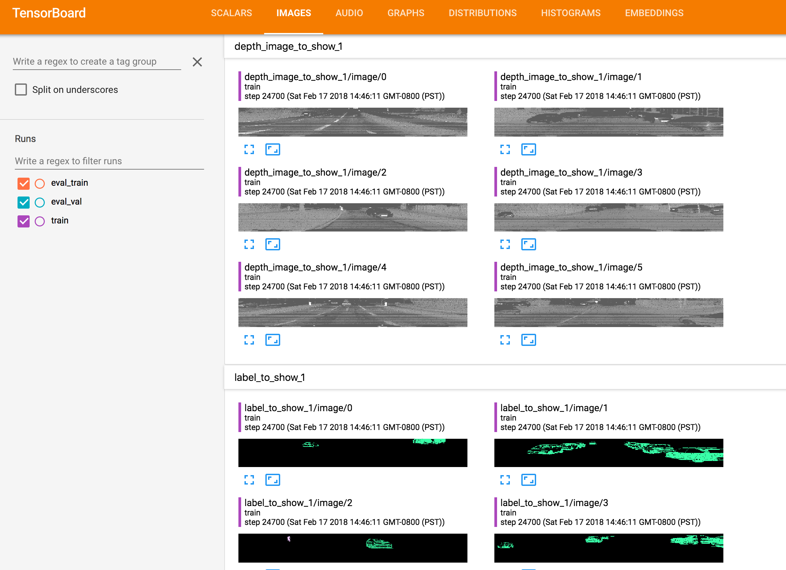
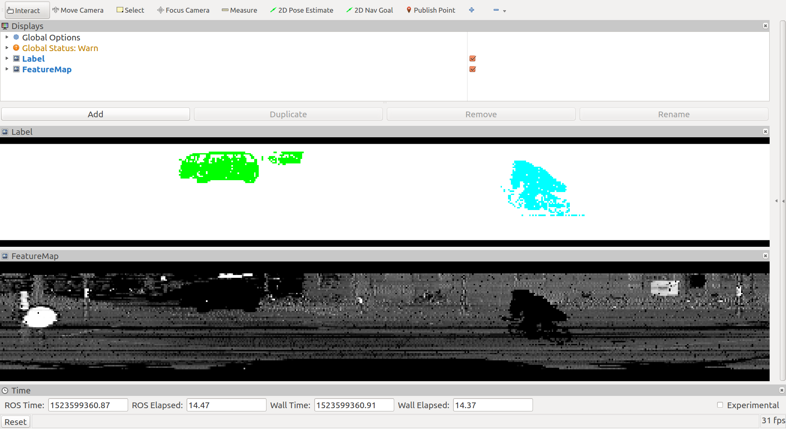
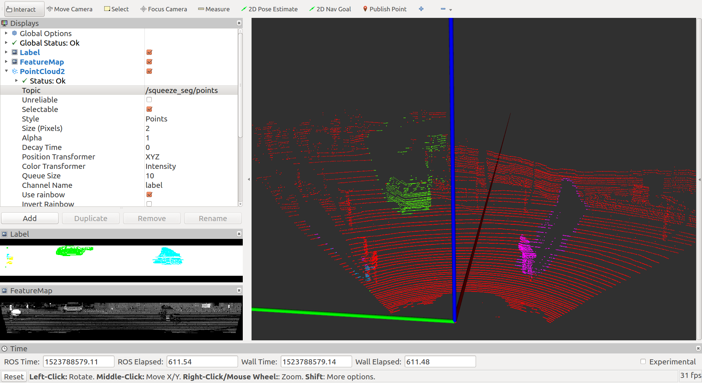

## _SqueezeSeg_: Convolutional Neural Nets with Recurrent CRF for Real-Time Road-Object Segmentation from 3D LiDAR Point Cloud

By Bichen Wu, Alvin Wan, Xiangyu Yue, Kurt Keutzer (UC Berkeley)

This repository contains a tensorflow implementation of SqueezeSeg, a convolutional neural network model for LiDAR segmentation. A demonstration of SqueezeSeg can be found below:

<p align="center">

</p>

Please refer to our video for a high level introduction of this work: https://youtu.be/Xyn5Zd3lm6s. For more details, please refer to our paper: https://arxiv.org/abs/1710.07368. If you find this work useful for your research, please consider citing:

```latex
@article{wu2017squeezeseg,
    title={Squeezeseg: Convolutional neural nets with recurrent crf for real-time road-object segmentation from 3d lidar point cloud},
    author={Wu, Bichen and Wan, Alvin and Yue, Xiangyu and Keutzer, Kurt},
    journal={arXiv preprint arXiv:1710.07368},
    year={2017}
}
```

## License
**SqueezeSeg** is released under the BSD license (See [LICENSE](https://github.com/BichenWuUCB/SqueezeSeg/blob/master/LICENSE) for details). The **dataset** used for training, evaluation, and demostration of SqueezeSeg is modified from [KITTI](http://www.cvlibs.net/datasets/kitti/) raw dataset. For your convenience, we provide links to download the converted dataset, which is distrubited under the [Creative Commons Attribution-NonCommercial-ShareAlike 3.0 License](https://creativecommons.org/licenses/by-nc-sa/3.0/).

## Installation:

The instructions are tested on Ubuntu 16.04 with python 2.7 and tensorflow 1.0 with GPU support (CUDA 8.0 and cuDNN 5.1). 
- Clone the SqueezeSeg repository:
    ```Shell
    $ git clone https://github.com/BichenWuUCB/SqueezeSeg.git
    ```
     We name the root directory as `$SQSG_ROOT`.

- Setup virtual environment:
    1. By default we use Python2.7. Create the virtual environment
       ```Shell
       $ virtualenv env
       ```
    2. Activate the virtual environment
       ```Shell
       $ source env/bin/activate
       ```

    3. [option] I recommend to use `virtualenvwrapper`

       ```shell
       $ pip install virtualenvwrapper
       # configure virtualenvwrapper
       $ mkdir $HOME/.local/virtualenvs
       # append contents in `~/.bashrc`
       $ sudo vim ~/.bashrc
       # always use pip/distribute
       export VIRTUALENV_USE_DISTRIBUTE=1
       # directory to store all virtual environment 
       export WORKON_HOME=$HOME/.local/virtualenvs
       if [ -e $HOME/.local/bin/virtualenvwrapper.sh ]; then
         source $HOME/.local/bin/virtualenvwrapper.sh
       else if [ -e /usr/local/bin/virtualenvwrapper.sh ]; then
         source /usr/local/bin/virtualenvwrapper.sh
       fi
       export PIP_VIRTUALENV_BASE=$WORKON_HOME
       export PIP_RESPECT_VIRTUALENV=true
       # enable virtualenvwrapper
       $ source ~/.bashrc
       # create virtual environment with python2.7 and tensorflow 1.0.0
       $ mkvirtualenv -p /usr/bin/python2.7 python1.0.0
       ```

-   Use pip to install required Python packages:

    ```Shell
      $ workon python1.0.0
      (python1.0.0) $ pip install -r requirements.txt
    ```

## Demo:
- To run the demo script:
  ```Shell
  $ cd $SQSG_ROOT/
  $ workon python1.0.0
  (python1.0.0) $ python ./src/demo.py
  ```
  If the installation is correct, the detector should write the detection results as well as 2D label maps to `$SQSG_ROOT/data/samples_out`. Here are examples of the output label map overlaped with the projected LiDAR signal. Green masks indicate clusters corresponding to cars and blue masks indicate cyclists.
  <p align="center">
    
  </p>


## Training/Validation
- First, download training and validation data (3.9 GB) from this [link](https://www.dropbox.com/s/pnzgcitvppmwfuf/lidar_2d.tgz?dl=0). This dataset contains LiDAR point-cloud projected to a 2D spherical surface. Refer to our paper for details of the data conversion procedure. This dataset is converted from [KITTI](http://www.cvlibs.net/datasets/kitti/) raw dataset and is distrubited under the [Creative Commons Attribution-NonCommercial-ShareAlike 3.0 License](https://creativecommons.org/licenses/by-nc-sa/3.0/).
  ```Shell
  $ cd $SQSG_ROOT/data/
  $ wget https://www.dropbox.com/s/pnzgcitvppmwfuf/lidar_2d.tgz
  $ tar -xzvf lidar_2d.tgz
  $ rm lidar_2d.tgz
  ```

- Now we can start training by
  ```Shell
  $ cd $SQSG_ROOT/
  $ workon python1.0.0
  (python1.0.0) $ ./scripts/train.sh -gpu 0 -image_set train -log_dir ./log/
  ```
   Training logs and model checkpoints will be saved in the log directory.

- We can launch evaluation script simutaneously with training
  ```Shell
  $ cd $SQSG_ROOT/
  $ workon python1.0.0
  (python1.0.0) $ ./scripts/eval.sh -gpu 1 -image_set val -log_dir ./log/
  ```
  
- We can monitor the training process using tensorboard.
  ```Shell
  (python1.0.0) $ tensorboard --logdir=$SQSG_ROOT/log/
  ```
    Tensorboard displays information such as training loss, evaluation accuracy, visualization of detection results in the training process, which are helpful for debugging and tunning models, as shown below:

  <p align="center">
    
  </p>
  <p align="center">
    
  </p>

## ROS
- [x] Training dataset visualization
+ quick start
    ```shell
    $ ./scripts/quickstart.sh 
    Usage: ./scripts/quickstart.sh [options]
    
    options:
    -h, --help                show brief help
    -rviz_cfg                 rviz configure file.
    $ ./scripts/npy_player.sh  -data_dir ./data/lidar_2d
    ```
+ safely quit
    ```shell
    $ ./scripts/killall.sh
    ```
<p align="center">
    
</p>

- [ ] Online point cloud segmentation
```bash
$ ./scripts/killall.sh

$ ./scripts/online.sh -h
Usage: ./scripts/online.sh [options]
 
options:
-h, --help                show brief help
-sub_topic                subscribe point cloud topic, default '/kitti/points_raw'.
# start online segmentation node
$ ./scripts/online.sh
# start any node you have to publish point cloud in "sub_topic"
```

<p align="center">
    
</p>